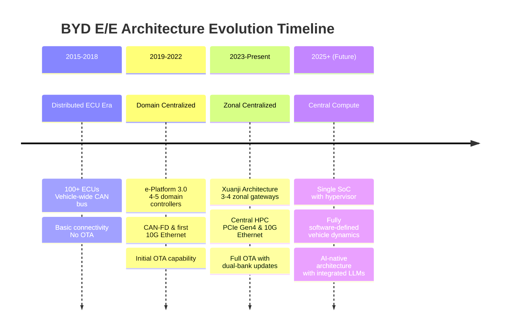
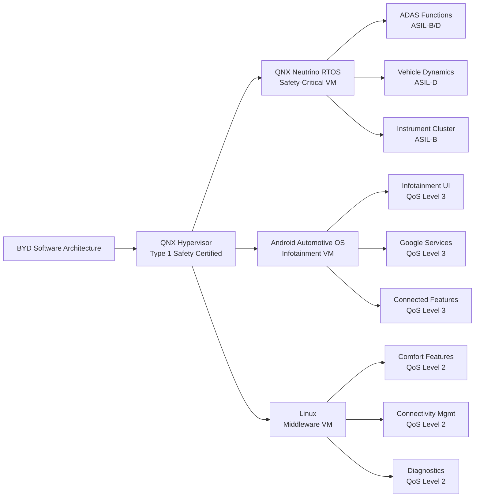
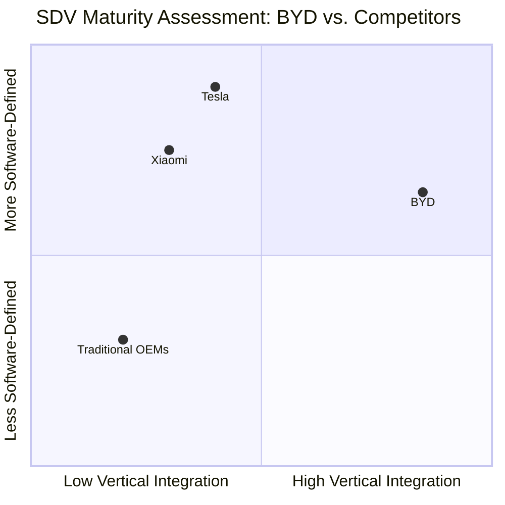

# Comprehensive Architectural Analysis of BYD's Software-Defined Vehicle Strategy

## Executive Summary

BYD's architectural evolution represents a **masterful balance** between vertical integration and strategic partnerships, creating a unique competitive position in the global automotive landscape. The company has progressed from **distributed ECUs** to a **domain-centralized architecture** with e-Platform 3.0, and is now transitioning toward **zonal-centralized computing** with its Xuanji architecture. Unlike pure software-defined vehicle (SDV) approaches like Tesla's, BYD maintains a **hybrid model** that leverages both in-house development and strategic partnerships, allowing it to achieve aggressive cost leadership while rapidly advancing technical capabilities. This analysis reveals that BYD is **not yet fully software-defined** compared to Tesla, but its vertical integration strategy provides unparalleled speed-to-market and cost advantages that make it a formidable competitor in the EV space.

## 1 E/E & Hardware Compute Architecture Evolution

### 1.1 Architectural Timeline and Progression

BYD's electrical/electronic architecture has undergone a systematic evolution across three distinct generations, each characterized by increasing centralization and computational integration:

The **e-Platform 3.0** marked BYD's transition from distributed ECUs to a **domain-centralized architecture**, dramatically enhancing computing power integration while reducing wiring complexity by approximately 20%. This architecture consolidated previously distributed functions into **four primary domain controllers**: Cockpit Domain Controller (CDC), ADAS Domain Controller, Vehicle Domain Controller (VDC), and Powertrain Domain Controller (PDC). The current generation, embodied in the **Xuanji Architecture**, moves toward a **zonal-centralized approach** with physical zones (Front, Left, Right, Rear) each containing a zonal gateway that aggregates sensors and actuators while communicating with central compute clusters via high-speed networks.

### 1.2 Hardware Stack and Topology

BYD's current hardware architecture represents a **hybrid approach** that combines elements of both domain-centralized and zonal-centralized strategies:

- **Central Compute Cluster**: The heart of the system is a **high-performance computing (HPC) platform** typically based on NVIDIA Drive Orin or equivalent SoCs, providing 200-250 TOPS of AI performance for ADAS and cockpit functions. This central processor runs multiple operating systems via **hardware virtualization** (QNX Hypervisor), enabling simultaneous execution of safety-critical and infotainment applications.

- **Zonal Gateways**: The vehicle is divided into **3-4 physical zones** (typically Front, Left, Right, Rear), each with a zonal controller that serves as both an I/O aggregation point and a local compute node. These gateways handle **time-critical control functions** (e.g., active suspension, lighting) locally while forwarding complex data to the central compute cluster. The zonal gateways are interconnected via **redundant 10BASE-T1S Ethernet** and **CAN-FD** networks, with the backbone using **PCIe Gen4** for high-bandwidth communication.

- **Domain Controllers**: BYD retains **specialized domain controllers** for functions requiring deep integration or safety certification, including:
  - **Cockpit Domain Controller**: Integrates instrument cluster, infotainment, and HUD functions, typically running Android Automotive OS (AAOS) alongside QNX for safety-critical elements.
  - **ADAS Domain Controller**: Houses the primary perception and planning algorithms, utilizing NVIDIA Orin or Horizon Robotics Journey series chips.
  - **Vehicle Dynamics Controller**: Manages chassis, braking, and steering functions, often implemented as an ASIL-D certified unit separate from central compute.

*Table: BYD Hardware Compute Stack Across Vehicle Tiers*

| **Component** | **Ocean/Dynasty Series** | **Premium Brands (Yangwang/Fangchengbao)** | **Connectivity** |
|---------------|--------------------------|--------------------------------------------|------------------|
| **Central Compute** | NVIDIA Orin (128-256 TOPS) | NVIDIA Orin (254+ TOPS) | PCIe Gen4 x16 |
| **Cockpit Processor** | Qualcomm 8155/8295 | BYD9000 (in-development) | 10G Ethernet |
| **Zonal Gateways** | 3 zones (Front, Rear, Cabin) | 4 zones (with redundancy) | CAN-FD + 10BASE-T1S |
| **ADAS Processor** | Horizon Robotics Journey 5/6 | NVIDIA Orin (dual) | SerDes for cameras |
| **MCUs** | NXP S32K3xx | Infineon AURIX TC3xx | LIN/CAN-FD |

### 1.3 Supply Chain & Tier-1 Dynamics

BYD's supply chain strategy exemplifies its **vertical integration philosophy** while maintaining strategic partnerships for specialized technologies:

- **In-House Manufacturing (FinDreams)**: Through its FinDreams subsidiary, BYD manufactures **critical components** including batteries, power semiconductors, motors, and electronic controls. This captures approximately **25% of vehicle cost** internally, providing significant cost advantages and supply chain security. FinDreams Battery has mapped its entire supply chain, including mineral sourcing, to ensure ESG compliance and production data transparency.

- **Strategic Partnerships**: BYD maintains targeted partnerships for technologies where external expertise provides acceleration:
  - **NVIDIA**: Provides the DRIVE Orin platform for mid-to-high-tier DiPilot systems, offering market-leading compute power today.
  - **Horizon Robotics**: Supplies Journey series chips for entry-to-mid-level ADAS functions, offering a cost-effective alternative to NVIDIA solutions.
  - **Black Sesame Technologies**: Provides perception SoCs for specific ADAS applications, particularly in cost-sensitive models.
  - **Cerence AI**: Powers the conversational in-car AI assistant using LLM technology, enhancing voice interaction capabilities.

*Table: BYD Vertical Integration vs. Strategic Partnerships*

| **Technology Area** | **In-House Development** | **Strategic Partnerships** | **Rationale** |
|---------------------|--------------------------|----------------------------|---------------|
| **Batteries** | LFP Blade Batteries | - | Core technology, cost control |
| **Power Semiconductors** | IGBTs, SiC modules | - | Vertical integration, performance optimization |
| **ADAS Compute** | In-development (80 TOPS) | NVIDIA, Horizon Robotics | Pragmatic acceleration, cost optimization |
| **Cockpit SoC** | BYD9000 (in-development) | Qualcomm | Long-term self-sufficiency |
| **Software Stack** | Xuanji Architecture | Cerence, DeepSeek | Specialized AI capabilities |
| **Sensors** | - | Valeo, Continental | Specialized expertise, scale economics |

### 1.4 Controller Strategy vs. Central Processors

BYD's architectural approach maintains a **balanced distribution** between centralized processing and edge controllers, reflecting both technical requirements and business considerations:

- **Central Compute Percentage**: Approximately **60-70% of vehicle software** by lines of code runs on central compute clusters, primarily for ADAS, cockpit, and vehicle dynamics functions. The remaining **30-40%** resides on edge controllers and zonal gateways, primarily for real-time control and I/O processing.

- **MCU Replacement Strategy**: BYD is **not pursuing complete MCU elimination**. Instead, it maintains a **hierarchical control strategy** where:
  - **Safety-critical real-time functions** (braking, steering, suspension) remain on dedicated ASIL-D certified MCUs (typically Infineon AURIX or NXP S32K3 series) for deterministic response.
  - **Convenience and comfort functions** (lighting, climate, seat adjustment) are migrating to zonal gateways with integrated MCUs, reducing wiring complexity.
  - **High-compute functions** (perception, planning, HMI) are consolidated into central processors for efficiency and upgradability.

- **Business Rationale**: This approach allows BYD to:
  - **Maintain safety certification** without complex mixed-criticality certification challenges on central processors.
  - **Reduce wiring complexity** by 40% compared to distributed architectures while avoiding the full cost of immediate centralization.
  - **Optimize cost** by using appropriate processing resources for each function rather than over-provisioning central compute.

## 2 Software Architecture, Standards & OS Strategy

### 2.1 Operating Systems & Virtualization

BYD's OS strategy employs a **mixed-criticality approach** that leverages different operating systems optimized for specific domains while ensuring safety and security through hardware virtualization:

- **QNX Neutrino RTOS**: Serves as the **foundation for safety-critical systems** including instrument cluster, ADAS functions, and vehicle dynamics control. QNX's microkernel architecture and POSIX certification make it ideal for ASIL-B/D applications requiring deterministic behavior. The QNX Hypervisor enables **multiple isolated virtual machines** on a single SoC, allowing simultaneous execution of QNX, Android, and Linux environments while maintaining strict separation between safety-critical and infotainment domains.

- **Android Automotive OS (AAOS)**: Powers the **infotainment and connected services** experience, providing access to the Google ecosystem including Maps, Play Store, and Assistant. BYD's implementation runs as a **guest OS under the QNX Hypervisor**, ensuring that critical vehicle functions remain protected from potential Android system failures. This approach provides **familiarity for consumers** while maintaining automotive-grade reliability requirements.

- **Linux**: Used for **specific middleware components** and **non-critical applications** where open-source flexibility and broad developer support are advantageous. BYD's Linux implementation is typically confined to **non-safety-critical domains** such as comfort features and connectivity management, running in its own virtualized partition.

### 2.2 Middleware & SOA Framework

BYD's Service-Oriented Architecture (SOA) represents a **hybrid approach** between proprietary optimization and standardized middleware:

- **Xuanji Intelligent Architecture**: BYD's proprietary SOA framework serves as the **central nervous system** of the vehicle, enabling service discovery, communication, and orchestration across domains. This architecture provides:
  - **Standardized service interfaces** for cross-domain communication
  - **Dynamic service composition** for feature creation
  - **Over-the-air service updates** without reflashing entire ECUs
  - **Secure communication channels** between vehicle and cloud

- **Middleware Components**: While BYD maintains a proprietary core, it incorporates **standardized middleware** where beneficial:
  - **AUTOSAR Classic**: Used for **basic software layers** on MCUs and ECUs, providing standardized interfaces to hardware and diagnostic protocols.
  - **AUTOSAR Adaptive**: Implemented for **high-performance computing applications** where POSIX compliance and dynamic application deployment are required.
  - **DDS (Data Distribution Service)**: Adopted for **real-time data distribution** in safety-critical systems, providing publish-subscribe semantics with quality of service guarantees.

- **SOAFEE Alignment**: BYD has **engaged with the SOAFEE initiative** (Scalable Open Architecture For Embedded Edge) to align with industry standards for cloud-native automotive development 【turn0search30】【turn0search34】. This engagement focuses on:
  - **Hardware-agnostic application development**
  - **Cloud-native development practices**
  - **Containerization of vehicle applications**
  - **Standardized APIs for automotive services**

### 2.3 Consortium Standards Compliance

BYD's approach to industry standards follows a **pragmatic adoption strategy**, balancing standardization benefits with proprietary optimization needs:

*Table: BYD Standards Adoption Posture*

| **Standard** | **Implementation Status** | **Application Area** | **Future Roadmap** |
|--------------|---------------------------|----------------------|-------------------|
| **AUTOSAR Classic** | Full compliance | ECU basic software, diagnostics | Continued use for MCUs |
| **AUTOSAR Adaptive** | Partial implementation | High-performance computing | Expanded use as centralization increases |
| **SOAFEE** | Engaged, pilot implementations | Cloud-native development | Gradual adoption as ecosystem matures |
| **ISO 26262** | Full compliance (ASIL-D) | Safety-critical systems | Continuous improvement for mixed-criticality |
| **ISO 21434** | Implementing cybersecurity | Vehicle cybersecurity | Full compliance by 2026 |

### 2.4 Safety Certification Implementation

BYD achieves ISO 26262 compliance through a **layered safety approach** that addresses both hardware and software aspects of mixed-criticality systems:

- **Hardware Isolation**: The QNX Hypervisor provides **strict spatial and temporal isolation** between virtual machines, ensuring that failures in non-critical partitions cannot affect safety-critical functions. This isolation is maintained through:
  - **Memory protection units** enforcing partition boundaries
  - **CPU scheduling guarantees** for critical partitions
  - **Resource quotas** preventing resource exhaustion attacks
  - **Hardware watchdogs** for each partition

- **Software Safety Measures**: Beyond hardware isolation, BYD implements:
  - **ASIL decomposition** where safety-critical functions are distributed across redundant channels
  - **Diverse software implementations** for critical functions to avoid common-cause failures
  - **Static analysis and formal verification** for safety-critical code
  - **Runtime monitoring** of safety-critical parameters with graceful degradation

- **Certification Strategy**: BYD pursues **system-level certification** rather than component-level certification, allowing it to optimize the overall architecture while maintaining safety case integrity. This approach requires **more rigorous safety analyses** but enables more efficient use of computing resources through mixed-criticality integration.

## 3 Autonomous Driving, AI & Silicon Strategy

### 3.1 In-House vs. Partnered ADAS Development

BYD's ADAS development strategy represents a **balanced approach** between in-house capability building and strategic partnerships:

- **In-House Development**: BYD has developed its **Xuanji intelligent driving architecture** in-house, focusing on:
  - **Perception algorithms** optimized for Chinese road conditions and traffic scenarios
  - **Planning and control algorithms** tailored to BYD's vehicle dynamics
  - **Sensor fusion strategies** leveraging BYD's vertical integration of sensors and actuators
  - **User experience design** for human-machine interface and interaction patterns

- **Strategic Partnerships**: BYD complements its in-house efforts with targeted partnerships:
  - **NVIDIA**: Provides the **hardware foundation** (DRIVE Orin) for high-performance ADAS compute, enabling BYD to focus on algorithm development rather than chip design 【turn0search7】【turn0search43】.
  - **DeepSeek**: Integration of the R1 large language model enhances **reasoning and decision-making** capabilities, particularly for complex urban scenarios common in China 【turn0search7】.
  - **Horizon Robotics**: Supplies **perception SoCs** for cost-sensitive models, allowing BYD to offer ADAS features across a broader price range 【turn0search16】【turn0search19】.
  - **Huawei**: For specialized applications like the Fangchengbao off-road brand, BYD utilizes Huawei's **Qiankun intelligent driving system** as a turnkey solution 【turn0search7】.

- **Development Roadmap**: BYD's ADAS development follows a **three-phase approach**:
  1. **Phase 1 (Current)**: Partnered solutions for rapid deployment and market entry
  2. **Phase 2 (In Progress)**: In-house development of core algorithms with partner-provided hardware
  3. **Phase 3 (Future)**: Fully in-house silicon and software stack with proprietary AI accelerators

### 3.2 Silicon Landscape Across Vehicle Tiers

BYD employs a **multi-supplier silicon strategy** that matches compute capabilities to vehicle positioning and price points:

*Table: BYD Silicon Strategy Across Vehicle Tiers*

| **Vehicle Tier** | **ADAS Processor** | **Cockpit Processor** | **Safety MCU** | **Performance** |
|------------------|--------------------|-----------------------|----------------|-----------------|
| **Entry (Seagull, Dolphin)** | Horizon Robotics Journey 3/5 | Qualcomm 8155 | NXP S32K3 | 16-64 TOPS |
| **Mainstream (Han, Tang)** | NVIDIA Orin (128 TOPS) | Qualcomm 8155/8295 | Infineon AURIX TC3xx | 128-200 TOPS |
| **Premium (Yangwang U9/U8)** | Dual NVIDIA Orin (254 TOPS) | BYD9000 (in-development) | Infineon AURIX TC3xx (redundant) | 254+ TOPS |
| **Off-Road (Fangchengbao)** | Huawei Qiankun system | BYD9000 | Redundant AURIX | 200+ TOPS |

- **In-House Silicon Development**: BYD Semiconductor is actively developing **bespoke automotive chips** to reduce external dependency and optimize for specific use cases:
  - **80 TOPS central controller chip**: Designed to compete with NVIDIA and Horizon Robotics offerings, targeted for mid-range vehicles.
  - **4nm smart cockpit chip (BYD9000)**: Aimed at premium vehicles, providing integrated AI acceleration for cockpit functions.
  - **Power semiconductors**: IGBTs and SiC modules manufactured in-house for powertrain applications, leveraging BYD's expertise in power electronics .

### 3.3 AI Ecosystem & Partnerships

BYD's AI ecosystem extends beyond autonomous driving to encompass **vehicle-wide intelligence** and manufacturing optimization:

- **Large Language Model Integration**: BYD has partnered with **DeepSeek** to integrate the R1 large language model into its DiPilot system, enhancing:
  - **Scene understanding** for complex urban environments
  - **Decision-making** in ambiguous traffic situations
  - **Natural language interaction** for voice-activated controls
  - **Predictive behavior** based on historical driving patterns

- **Cloud AI Infrastructure**: BYD utilizes **NVIDIA's AI infrastructure** for cloud-based development and training, leveraging:
  - **NVIDIA DGX systems** for algorithm training
  - **NVIDIA Omniverse** for digital twin and simulation
  - **NVIDIA Drive Sim** for virtual testing and validation
  - **Scalable cloud resources** for fleet learning and improvement

- **Manufacturing AI**: BYD's facilities incorporate **AI-powered robotics** and automation, with its Xi'an facility operating at approximately **97% autonomy** using:
  - **Automated guided vehicles** for material handling
  - **Computer vision systems** for quality inspection
  - **Predictive maintenance** for manufacturing equipment
  - **Digital twins** for process optimization 【turn0search44】

## 4 Connectivity, OTA & Connected-Car Infrastructure

### 4.1 Ground-Up Connectivity Architecture

BYD's connectivity approach is **deeply integrated** into vehicle platforms rather than implemented as an add-on feature:

- **Telematics Architecture**: BYD vehicles incorporate a **dedicated telematics control unit (TCU)** with redundant cellular connectivity (5G + LTE fallback) and GNSS positioning. The TCU maintains **constant communication** with BYD's cloud infrastructure for:
  - **Real-time vehicle diagnostics** and prognostics
  - **Over-the-air update management**
  - **Connected services** (navigation, remote control, emergency calls)
  - **Fleet management** data for commercial applications

- **Data Pipeline**: BYD's cloud infrastructure processes vehicle data through a **multi-layer architecture**:
  - **Edge processing** on vehicle for real-time safety-critical functions
  - **Regional gateways** for data aggregation and filtering
  - **Central cloud** for long-term storage and analytics
  - **AI training pipelines** for model improvement using fleet data

- **Cybersecurity Framework**: BYD implements a **defense-in-depth cybersecurity strategy** that includes:
  - **Secure boot** and runtime attestation for all ECUs
  - **Intrusion detection and prevention systems** on vehicle networks
  - **Secure communication channels** with mutual authentication
  - **Regular security updates** via OTA for vulnerabilities

### 4.2 OTA Update Technology

BYD's OTA update mechanism employs **state-of-the-art techniques** to ensure reliable and secure vehicle updates:

- **Dual-Bank Flashing**: Critical vehicle modules utilize **dual-bank flash memory** architecture that allows:
  - **Seamless updates** without disrupting vehicle operation
  - **Automatic rollback** if update validation fails
  - **Power-loss protection** during update process
  - **Simultaneous update** of multiple modules

- **Delta Compression**: BYD uses **binary delta compression** to reduce update sizes by 70-90% compared to full image updates, enabling:
  - **Faster downloads** via cellular networks
  - **Reduced data costs** for both BYD and customers
  - **More frequent updates** for smaller improvements
  - **Lower storage requirements** on vehicle modules

- **Update Orchestration**: BYD's OTA management system coordinates updates across multiple modules using:
  - **Dependency resolution** to ensure update sequence
  - **Pre-condition checks** (battery state, vehicle state, connectivity)
  - **Staged rollouts** with canary releases to monitor impact
  - **Customer scheduling** preferences for major updates

### 4.3 OTA Update Cadence

BYD maintains an **aggressive OTA update schedule** across its vehicle lineup:

- **Infotainment Updates**: Typically **every 4-6 weeks** for Android Automotive OS improvements, new features, and bug fixes. These updates are generally **transparent to users** and install automatically when vehicle is parked.

- **ADAS Updates**: **Quarterly updates** for perception and planning algorithms, with **emergency updates** for critical safety issues as needed. These updates often include:
  - **Improved object detection** for specific scenarios
  - **Refined control strategies** for smoother operation
  - **New feature enablement** (e.g., additional NoA scenarios)
  - **Performance optimizations** for reduced false positives

- **Vehicle Control Updates**: **Biannual updates** for chassis, powertrain, and comfort systems, with more frequent updates for specific modules as needed. These updates typically require:
  - **Service center visit** for safety-critical updates
  - **Customer notification** and scheduling
  - **Post-update verification** of system functionality
  - **Rollback capability** if issues are detected

## 5 Organizational & Market Strategy

### 5.1 Software-Defined Organization Structure

BYD's software engineering organization is structured to **balance integration with specialization** across its diverse brand portfolio:

- **Central Software Platform Team**: A core team of approximately **3,000 software engineers** develops the foundational software platform including:
  - **Xuanji architecture** and middleware
  - **AUTOSAR basic software** and integration
  - **Cybersecurity framework** implementation
  - **OTA infrastructure** and update management
  - **Diagnostic protocols** and tooling

- **Brand-Specific Development Teams**: Each BYD brand (Ocean/Dynasty, Yangwang, Fangchengbao, Denza) has dedicated software teams focused on:
  - **Brand-specific user experiences** and interfaces
  - **Performance tuning** for vehicle dynamics
  - **Feature differentiation** based on positioning
  - **Integration with brand-specific hardware**

- **Vertical Integration Engineering**: Cross-functional teams work on **hardware-software co-design** across BYD's vertically integrated components:
  - **Battery management system** optimization
  - **Power semiconductor control** algorithms
  - **Motor control** integration with vehicle dynamics
  - **Charging system** intelligence

### 5.2 Cost and Velocity Competitiveness

BYD's competitive advantages in **time-to-market and cost leadership** stem directly from its architectural and organizational choices:

- **Vertical Integration Benefits**: BYD's control of approximately **70% of vehicle components** by cost provides several advantages:
  - **Reduced supply chain coordination** overhead and complexity
  - **Optimized component integration** without interface negotiations
  - **Cost reduction** through internal margin elimination
  - **Priority allocation** during supply constraints

- **Speed-to-Market Advantages**: BYD's development velocity outpaces traditional OEMs through:
  - **Concurrent engineering** across hardware and software teams
  - **Rapid prototyping** using in-house manufacturing capabilities
  - **Shorter decision cycles** without extensive supplier negotiations
  - **Integrated testing** across components without interface ambiguities

- **Cost Leadership Mechanics**: BYD achieves approximately **25% cost reduction** compared to competitors through:
  - **Internal component margins** captured rather than paid to suppliers
  - **Optimized designs** without supplier-influenced over-specification
  - **Scale economies** in component production
  - **Reduced logistics costs** through localized supply chains

## 6 Comparative Synthesis and Assessment

### 6.1 Evolution Matrix: BYD's Architectural Progression

*Table: BYD E/E and Software Stack Evolution*

| **Generation** | **E/E Architecture** | **Compute Topology** | **Software Strategy** | **Key Innovation** | **Limitations** |
|----------------|----------------------|----------------------|-----------------------|-------------------|-----------------|
| **Gen 1 (2015-2018)** | Distributed ECUs | 100+ ECUs, CAN bus | Supplier-provided software, minimal integration | Basic connectivity, no OTA | Slow feature updates, high wiring complexity |
| **Gen 2 (2019-2022)** | Domain-centralized | 4-5 domain controllers | Mixed in-house and supplier software | e-Platform 3.0, initial OTA | Limited centralization, supplier dependencies |
| **Gen 3 (2023-Present)** | Zonal-centralized | 3-4 zones + central HPC | Hybrid proprietary/standardized stack | Xuanji architecture, full OTA | Mixed-criticality complexity, evolving standards |
| **Gen 4 (Future)** | Central compute | Single SoC with hypervisor | Fully software-defined stack | AI-native integration, LLM-powered | High upfront investment, transition risk |

### 6.2 The SDV Litmus Test: BYD vs. Tesla vs. Xiaomi

- **BYD's Position**: BYD occupies a **unique quadrant** with **high vertical integration** but **moderate software-defined maturity**. While its Xuanji architecture provides many SDV benefits, its continued reliance on domain controllers and supplier software for some functions prevents full software-defined status. However, its vertical integration provides **cost and speed advantages** that pure SDV competitors like Tesla cannot match.

- **Tesla Comparison**: Tesla remains **more fully software-defined** with its centralized compute architecture and complete in-house software stack. However, BYD's vertical integration provides **greater cost control** and **faster hardware innovation cycles**, particularly in battery and power semiconductor technologies.

- **Xiaomi Comparison**: Xiaomi's approach is **more software-centric** from the outset but lacks BYD's **manufacturing depth** and **vertical integration**. Xiaomi's SDV maturity may eventually surpass BYD's, but BYD's cost structure and vehicle dynamics expertise provide durable competitive advantages.

### 6.3 Key Vehicle Archetypes and Architecture Deployment

BYD deploys its architectural approaches strategically across its brand portfolio to optimize for specific market segments:

- **Ocean/Dynasty Series**: Uses a **cost-optimized version** of the zonal architecture with:
  - **Reduced zonal gateway count** (3 vs. 4 in premium models)
  - **Mainstream silicon** (Qualcomm, Horizon Robotics)
  - **Standard OTA cadence** with quarterly updates
  - **Balanced performance** for value-conscious consumers

- **Yangwang Brand**: Implements a **performance-optimized architecture** with:
  - **Dual central compute** for redundancy and performance
  - **Premium silicon** (NVIDIA Orin, in-development BYD9000)
  - **Enhanced OTA capabilities** with feature-on-demand
  - **Track-focused tuning** for vehicle dynamics

- **Fangchengbao Brand**: Employs a **specialized off-road architecture** with:
  - **Huawei Qiankun system** for ADAS (pragmatic partnership)
  - **Redundant systems** for critical off-road functions
  - **Ruggedized components** and enhanced protection
  - **Specialized control strategies** for off-road scenarios

### 6.4 The Differentiation Playbook: BYD's Competitive Advantages

BYD's architectural and strategic choices create a **differentiated competitive position** built on five key pillars:

1. **Vertical Integration as a Cost Weapon**: BYD's control of 70% of vehicle components by cost provides a **structural cost advantage** of approximately 25% compared to competitors reliant on supplier ecosystems 【turn0search45】【turn0search48】. This allows BYD to:
   - **Undercut competitors** on price while maintaining margins
   - **Invest more aggressively** in R&D and software development
   - **Weather price wars** better than less integrated competitors
   - **Capture value** that would otherwise go to suppliers

2. **Speed-to-Market Through Integration**: BYD's concurrent engineering approach, enabled by vertical integration, allows **faster development cycles** than competitors dependent on supplier timelines. This results in:
   - **Rapid technology adoption** (e.g., 800V architecture, cell-to-pack batteries)
   - **Quicker feature deployment** through unified development
   - **Faster response** to market trends and competitive moves
   - **Shorter time-to-market** for new models and updates

3. **Pragmatic Technology Adoption**: BYD's balanced approach to technology development—**building in-house where strategic, partnering where pragmatic**—allows it to:
   - **Avoid technology dead-ends** by maintaining optionality
   - **Access best-in-class solutions** without over-investing in every technology
   - **Accelerate capability development** through targeted partnerships
   - **Reduce development risk** through proven supplier solutions where appropriate

4. **Architectural Flexibility for Market Segments**: BYD's ability to deploy **variants of its architecture** across brands and price points allows it to:
   - **Optimize cost** for value segments while maintaining profitability
   - **Premium features** for high-end brands without architecture changes
   - **Rapid customization** for regional market requirements
   - **Gradual technology rollout** from premium to mainstream segments

5. **Manufacturing Excellence at Scale**: BYD's **AI-powered manufacturing facilities** operating at 97% autonomy provide:
   - **Consistent quality** across high production volumes
   - **Rapid scaling** of new models and technologies
   - **Cost reduction** through manufacturing efficiency
   - **Faster iteration** on manufacturing processes

## Conclusion: BYD's Strategic Position in the SDV Landscape

BYD's approach to software-defined vehicles represents a **distinctively Chinese model** that balances vertical integration with strategic partnerships, and in-house development with pragmatic technology adoption. While not as fully software-defined as Tesla, BYD's **hybrid architectural approach** provides compelling advantages in cost, speed, and flexibility that make it a formidable competitor in the global automotive market.

The company's **vertical integration strategy**—exemplified by FinDreams and in-house semiconductor development—creates a durable competitive moat that pure software companies like Xiaomi cannot easily replicate. Meanwhile, its **pragmatic partnership strategy** allows it to access cutting-edge technologies without over-investing in every domain, maintaining financial flexibility while accelerating capability development.

As the automotive industry continues its transformation toward software-defined vehicles, BYD's **balanced approach** positions it well for the transition. Its ongoing investments in **centralized compute architecture**, **proprietary silicon**, and **AI-powered systems** will gradually increase its software-defined maturity while maintaining its structural cost advantages. This combination makes BYD not just a leading EV manufacturer, but a **full-stack automotive company** with capabilities spanning from mining to software, positioning it for continued success in the evolving mobility landscape.